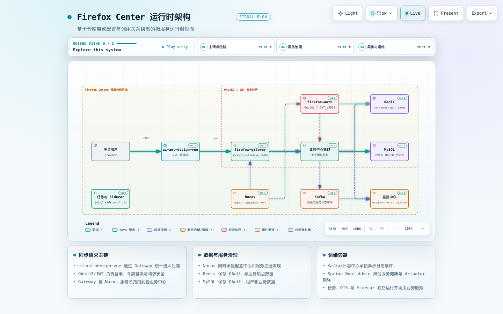

# java-firefox_center_open_platform

[English](README.md) | [简体中文](README.zh-CN.md)

[TOC]

## 1. 项目介绍

* 前后端分离的企业级微服务架构
* 基于 `Spring Boot 2.0.X`、`Hoxton.RELEASE` 和 `Spring Cloud Alibaba`
* 深度定制 `Spring Security`，实现基于 RBAC、JWT 和 OAuth 2.0 的无状态统一权限认证方案
* 提供应用管理，方便第三方系统接入
* 引入组件化思想，实现高内聚、低耦合；项目代码简洁、注释丰富、容易上手
* 注重代码规范，严格控制包依赖，每个工程基本保持最小依赖
&nbsp;

## 2. 运行时架构

该运行时架构基于仓库中的启动配置、Gateway 路由、服务发现、Feign 客户端、认证流程、持久化和监控配置绘制。



可以查看[交互式架构图](docs/architecture/firefox-runtime.architecture.html)，或检查 [Archify 架构源文件](docs/architecture/firefox-runtime.architecture.json)。

## 3. 功能介绍

* **统一认证功能**
  * 支持 OAuth 2.0 的四种授权模式
  * 支持用户名、密码和图形验证码登录
  * 支持手机号加密码登录
  * 支持 OpenID 登录
  * 支持第三方系统单点登录

* **分布式系统基础支撑**
  * 服务注册与发现、路由和负载均衡
  * 服务降级与熔断
  * URL 和方法级别的服务限流
  * 统一配置中心
  * 统一日志中心
  * 统一分布式缓存操作类和 CacheManager 配置扩展
  * 分布式锁
  * 分布式任务调度器
  * 支持前后端 CI/CD 持续集成
  * 分布式高性能 ID 生成器
* **系统监控功能**
  * 服务调用链监控
  * 应用拓扑图
  * 慢服务检测
  * 服务指标监控
  * 应用健康、JVM、内存和线程监控
  * 错误日志查询
  * 慢查询 SQL 监控
  * 应用吞吐量监控，包括 QPS 和 RT
  * 服务降级与熔断监控
  * 服务限流监控
* **业务基础功能支撑**
  * 高性能方法级幂等性支持
  * RBAC 权限管理，实现方法和 URL 级别的细粒度控制
  * 快速实现数据导入、导出功能
  * 数据库访问层自动实现 CRUD 操作
  * 代码生成器
  * 基于 Hutool 的各种便利开发工具
  * 网关聚合所有服务的 Swagger API 文档
  * 统一跨域处理
  * 统一异常处理

&nbsp;

## 4. 模块说明

```lua
java-firefox_center -- 父项目和公共依赖管理
│  ├─firefox-api -- Feign 接口
│  ├─firefox-auth -- Spring Security 认证中心 [8000]
│  ├─firefox-center -- 业务模块一级工程
│  │  ├─app-center -- 应用中心 [7001]
│  │  ├─config-center -- 配置中心 [7000]
│  │  ├─file-center -- 资源中心 [5000]
│  │  ├─log-center -- 日志中心 [7099]
│  │  ├─sys-center -- 管理中心 [7100]
│  │  ├─user-center -- 用户中心 [7002]
│  │  ├─code-generator -- 代码生成器 [7300]
│  │─firefox-commons -- 通用工具一级工程
│  │  ├─firefox-auth-client -- 封装 Spring Security 客户端的通用操作逻辑
│  │  ├─firefox-base -- 封装通用基础逻辑
│  │  ├─firefox-db -- 封装数据库通用操作逻辑
│  │  ├─firefox-log -- 封装日志通用操作逻辑
│  │  ├─firefox-mq -- 封装消息队列通用操作逻辑
│  │  ├─firefox-redis -- 封装 Redis 通用操作逻辑
│  │  ├─firefox-ribbon -- 封装 Ribbon 和 Feign 通用操作逻辑
│  │  ├─firefox-sentinel -- 封装 Sentinel 通用操作逻辑
│  │  ├─firefox-swagger2 -- 封装 Swagger 通用操作逻辑
│  ├─firefox-config -- 配置中心
│  ├─firefox-doc -- 项目文档
│  ├─firefox-gateway -- 网关
│  ├─firefox-job -- 分布式任务调度一级工程
│  │  ├─firefox-job-admin -- 任务管理器 [8081]
│  │  ├─firefox-job-core -- 任务调度核心代码
│  │  ├─firefox-job-executor-samples -- 任务执行器样例 [8082]
│  ├─firefox-monitor -- 监控一级工程
│  │  ├─firefox-monitor-sc-admin -- 应用监控 [6500]
│  │  ├─firefox-monitor-log-center -- 日志中心 [6200]
│  ├─firefox-register -- Nacos 注册中心 [8848]
│  ├─firefox-search -- 搜索引擎一级工程
│  ├─firefox-sidecar -- Sidecar 服务
│  ├─firefox-web -- 前端一级工程
│  │  ├─back-web -- 后台前端 [8066]
```

&nbsp;
